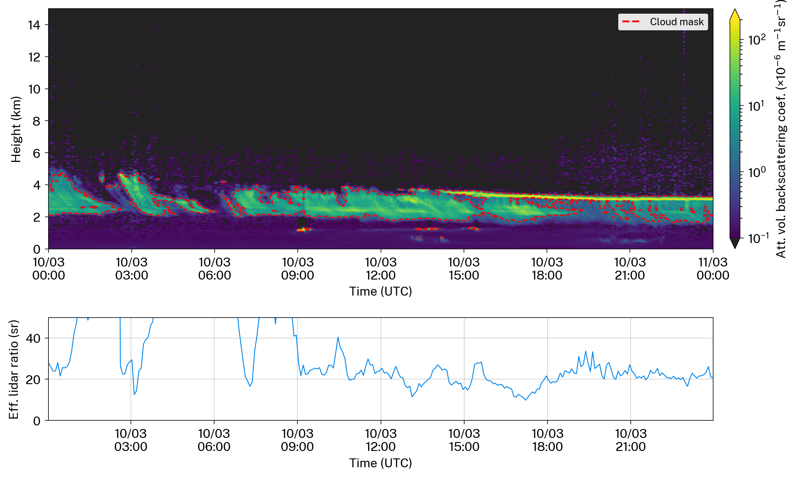
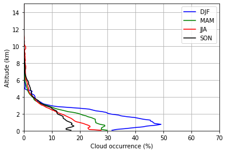
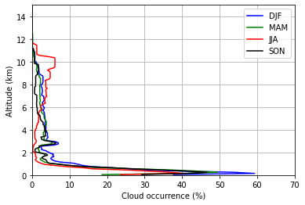
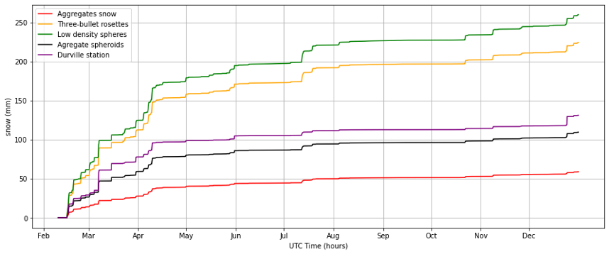
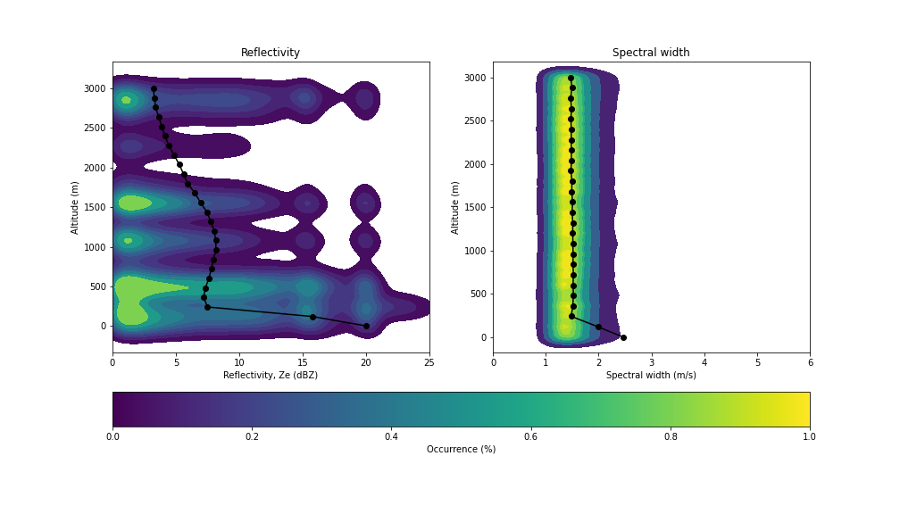
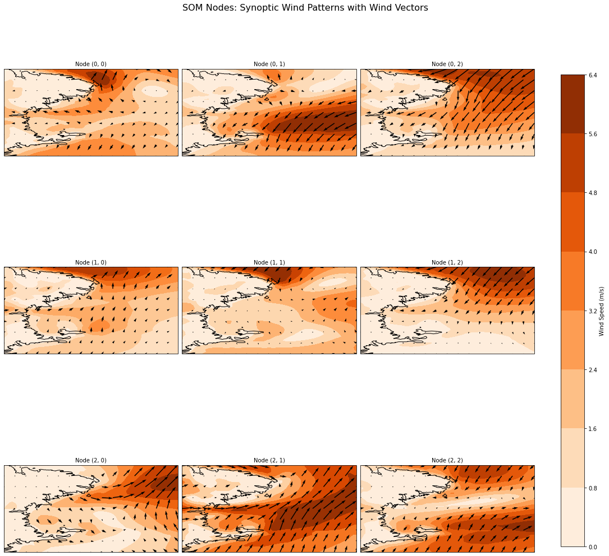
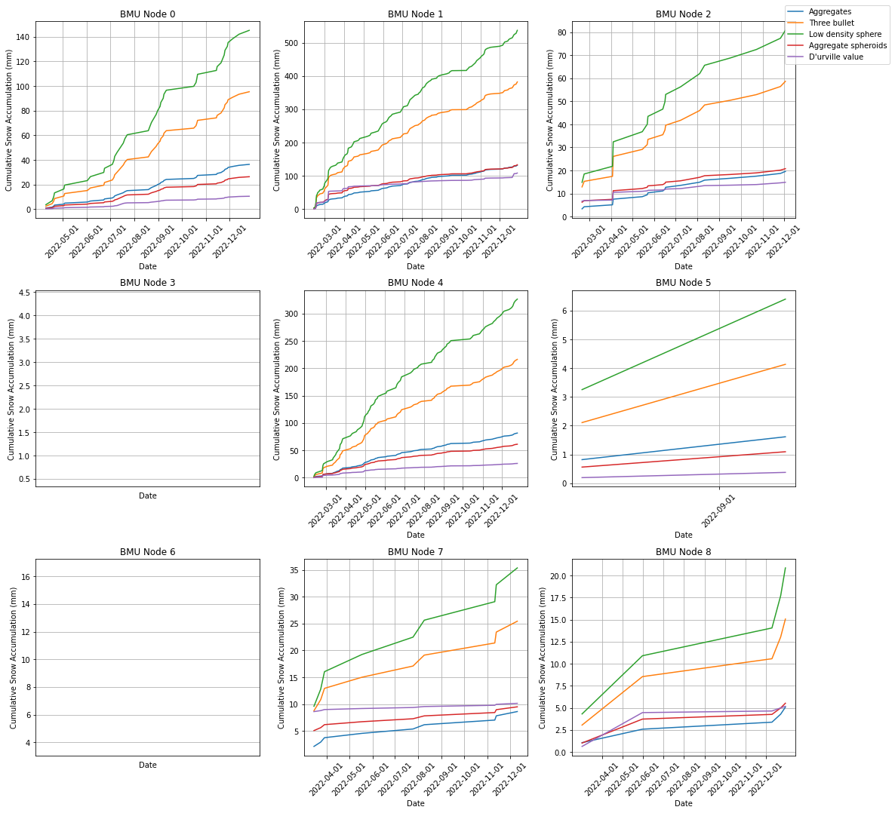

# Cloud and Snowfall Study in Antarctica

## Project Overview
This project investigates cloud formation and snowfall patterns in Antarctica using advanced lidar and radar data. By leveraging these technologies, we aim to enhance our understanding of atmospheric conditions and precipitation dynamics in this unique and critical region of the Earth. We also want to see how likely it is that supercooled liquid water clouds will produce heavy snowfall.

## Results
Our analysis yielded several key findings:

1. **Lidar Climatology:** Analysis of lidar data provided insights into the vertical distribution of clouds, revealing significant variations in cloud height and thickness over different seasons.

- Attenuated volume backscatter profile

  <!-- Update with your actual figure path -->

- Observational Cloud Occurrence in 2022


- MERRA2 Cloud Occurrence in 2022



2. **Radar Climatology:** Radar data helped quantify precipitation rates, indicating how snowfall varies spatially and temporally across the Antarctic landscape.

- Radar reflectivity, Doppler velocity, spectral width and snow rate
  <!-- Update with your actual figure path -->


3. **Snow Accumulation:** The study assessed snow accumulation trends, highlighting periods of significant accumulation and their correlation with prevailing weather patterns.

- Snow accumulation for 2022

  <!-- Update with your actual figure path -->

- Kernel density estimate plot


5. **Snow Accumulation Based on Synoptic Weather Patterns:** Utilizing Self-Organizing Maps (SOM), we identified distinct synoptic weather patterns that influence snow accumulation, providing a clearer understanding of how large-scale atmospheric conditions impact local snowfall.

- The sypnotic weather pattern from SOM

  <!-- Update with your actual figure path -->

- The snow accumulation classification


## Methodology
The analysis was conducted using a combination of lidar and radar datasets collected from Sott Base, Antarctica. The following steps summarize the general approach:

## Methodology
The analysis was conducted using a combination of lidar and radar datasets collected from various locations in Antarctica. The following steps summarize the general approach:

## Methodology
The analysis was conducted using a combination of lidar and radar datasets collected from various locations in Antarctica. The following steps summarize the general approach:

1. **Data Processing:** 
   - **Lidar Climatology:** Processed using ALCF Software, which automates the pre-processing of lidar and ceilometer data. For more information, visit [ALCF Software](https://alcf.peterkuma.net/).  <!-- Replace with the actual website link -->
   - **Radar Climatology:** Utilized the radar equation to calculate radar reflectivity, Doppler velocity, spectral width, and snow rate from the raw spectrum data.

2. **Climatological Analysis:** 
   - Derived snow accumulation from the calculated snow rate by performing a cumulative sum to identify periods with significant spikes in snow thickness.

3. **Synoptic Weather Pattern Analysis:** 
   - Trained Self-Organizing Maps (SOM) using 30 years of data to capture synoptic-scale weather patterns. These patterns were then applied to the snow accumulation data to analyze how different weather conditions influence snow accumulation.

## Installation
To run the analysis code, ensure you have the following Python packages installed:
- NumPy
- Matplotlib
- Pandas
- SciPy

You can install the required packages using pip:
```bash
pip install numpy matplotlib pandas scipy
