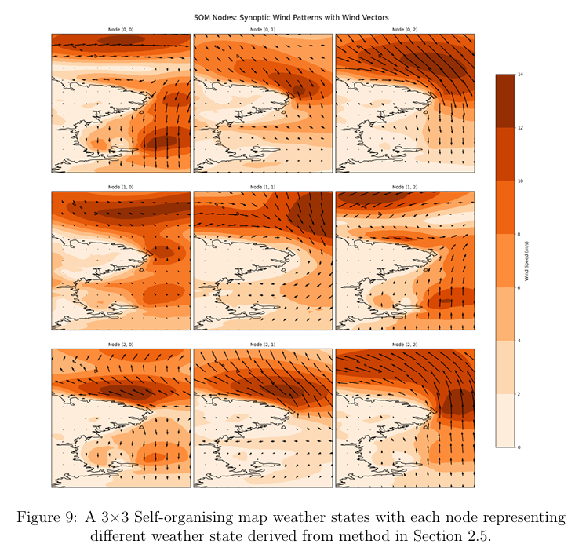

# Cloud and Snowfall Study in Antarctica
 

## Project Overview
This project investigates cloud properties and snowfall events over Scott Base, Antarctica, utilizing ground-based lidar and radar observations. The goal is to derive meaningful representations from complex atmospheric datasets using scientific analysis and machine learning techniques.

## Abstract
> Antarctica remains one of the least understood regions due to its remoteness and extreme climate, particularly in relation to cloud and snowfall processes. Climate models often struggle to simulate these aspects accurately, leading to biases, especially in cloud representation. Since clouds and snowfall regulate Earth’s radiative and surface mass balances, understanding them is critical. This study utilized Vaisala CL51 lidar and MRR2 radar to investigate cloud properties and snowfall over Antarctica. Data were reprocessed using the Automatic Lidar and Ceilometer Framework (ALCF), and radar data were used to derive reflectivity, Doppler velocity, and spectral width using methods proposed in Maahn and Kollias (2012). Seasonal variations showed greater cloud and snow buildup during summer and autumn, with initial evidence of supercooled liquid water clouds (SLWC) contributing to snowfall events.

---

## Results
Our analysis yielded several key findings:  

1. **Attenuated Backscattering Profile:**

In this section, we processed Vaisala CL51 lidar data to study the vertical structure of clouds. The attenuated backscattering profile helps reveal cloud layers, especially detecting supercooled liquid water clouds (SLWC) around 4 km altitude, indicated by backscatter values exceeding \(10^{-4} \, \text{m}^{-1} \, \text{sr}^{-1}\). This profile shows the evolution of cloud structure over time and is key to identifying potential snowfall events, offering direct visual insight into atmospheric layering over Scott Base.

- CL51 Ceilometer backscatter data
  <!-- Update with your actual figure path -->
 

- MERRAA2 Reanalysis backscattering

---

2. **Lidar Climatology:**

Moving from daily observations to seasonal trends, we analyzed lidar climatology to understand cloud occurrence patterns throughout 2022. Results showed the highest low-level cloud occurrences during austral autumn and summer, decreasing significantly during winter and spring. The lidar revealed that cloud occurrence peaks around 2 km altitude. This climatological study highlights the seasonal atmospheric dynamics of coastal Antarctica and underscores limitations in cloud representation within MERRA2 reanalysis models, which tend to underestimate low clouds and overestimate at high altitudes.

- Cloud occurrence

  <!-- Update with your actual figure path -->

---

3. **Radar Measurement Profile**
  
MRR2 radar data were processed to extract profiles of reflectivity (Ze), Doppler velocity, and spectral width. A case study on April 4, 2022, revealed persistent snowfall characterized by elevated reflectivity (up to 20 dBZ) around 1 km altitude. Doppler velocity measurements confirmed downward motion (snowfall), and variations in spectral width suggested atmospheric turbulence. This radar analysis not only validates snowfall events but also provides dynamic insights into the microphysical processes during snow events.

- Reflectivity, doppler velocity, precipitation rate

  <!-- Update with your actual figure path -->

---

4. **Radar climatology**

Using a full annual dataset, we derived the radar climatology, showing how median reflectivity and Doppler velocity change with height. The findings revealed that snow particles are more concentrated below 1.5 km altitude, consistent with other Antarctic coastal studies. Snow accumulation was estimated using various Ze-Sr relationships, showing that the greatest buildup occurred during summer and autumn seasons. This analysis demonstrates the sensitivity of snowfall to seasonal atmospheric moisture increases.

- Median of Ze and V

  <!-- Update with your actual figure path -->

- The snow accumulation

---

5. **Weather State Classification using SOM**

Applying Self-Organizing Map (SOM) analysis to ERA5 surface wind data allowed classification of daily weather states influencing snow accumulation. Distinct synoptic regimes were identified, with Node (0,1)—associated with a low-pressure system north of the domain—accounting for 43% of snow events. The classification highlights how synoptic-scale atmospheric circulation patterns directly impact snowfall variability, providing valuable insights into the climate dynamics of coastal Antarctica.

- The sypnotic weather pattern from SOM

  <!-- Update with your actual figure path -->

- The snow accumulation classification

---

## Methodology
The analysis was conducted using a combination of lidar and radar datasets collected from various locations in Antarctica. The following steps summarize the general approach:

1. **Data Processing:** 
   - **Lidar Climatology:** Processed using ALCF Software, which automates the pre-processing of lidar and ceilometer data. For more information, visit [ALCF Software](https://alcf.peterkuma.net/).  <!-- Replace with the actual website link -->
   - **Radar Climatology:** Utilized the radar equation to calculate radar reflectivity, Doppler velocity, spectral width, and snow rate from the raw spectrum data.

2. **Climatological Analysis:** 
   - Derived snow accumulation from the calculated snow rate by performing a cumulative sum to identify periods with significant spikes in snow thickness.

3. **Synoptic Weather Pattern Analysis:** 
   - Trained Self-Organizing Maps (SOM) using 30 years of data to capture synoptic-scale weather patterns. These patterns were then applied to the snow accumulation data to analyze how different weather conditions influence snow accumulation.

## 📄 More Information
To learn more about the detailed methodology, results, and discussion, please refer to the [full project report](https://github.com/akemalkim/cloud-snowfall-antarctica/blob/main/Akmal_final_report%20(3).pdf) included in this repository.

---

